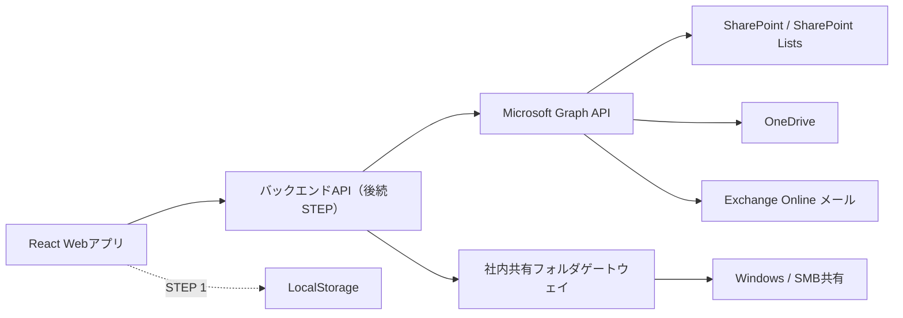

# 社内承認回覧

SharePoint、OneDrive、将来の社内共有フォルダに保存された業務ファイルを、案件ごとの専用URLで順番に承認回覧するWebアプリです。

デモ版：<https://waragamef-png.github.io/approval-circulation-app/>

現在はSTEP 1の完全ローカルUIモックとSTEP 2のGit管理用ファイル整備まで完了しています。Microsoft 365、実ファイル、実メールにはまだ接続していません。

## システム概要

案件を開始すると、推測されにくいランダムな専用URLが1案件につき1つ発行されます。

1. 対象ファイルと回付ルートを設定
2. 案件専用URLを現在の確認者へメールで通知
3. 案件ページの先頭に「現在誰の承認待ちか」を表示
4. 確認OK・捺印済みなら次の確認者へ回付
5. NGなら開始者または処理済み承認者へ差し戻し
6. 次の宛先用メールをWebアプリ内で確認・編集して送信
7. 最後の承認者が完了すると開始者へ完了通知

承認操作に対する本人確認やMicrosoft 365ログインは行わず、案件URLを持つ利用者が処理できる方式を採用します。後続STEPでMicrosoft 365を利用する場合も、ファイル参照やメール送信はバックエンド側だけで接続します。

## アーキテクチャ



### 現在の構成

- ブラウザだけで動作するReact SPA
- 承認者、テンプレート、案件、履歴をLocalStorageへ保存
- ダミーファイルとダミーユーザーを使用
- メール作成・編集・送信画面はUIデモ

### 本接続後の構成

- Microsoft 365接続はバックエンドまたは安全なGraphアクセス層へ集約
- 回覧データはSharePoint Listsへ保存
- ファイル本体はSharePoint / OneDrive上の元データを利用
- 通知メールは専用メールボックスからMicrosoft Graphで送信
- SMB共有は社内APIまたはWindowsサービスを介して接続

## 使用技術

- React 19
- TypeScript 5
- Vite 8
- pnpm
- LocalStorage（STEP 1のみ）
- Microsoft Graph API / バックエンドアプリ認証（後続STEP）
- SharePoint Lists（STEP 8以降）

## フォルダ構成

```text
approval-circulation-app/
├─ src/
│  ├─ App.tsx                    画面と回覧操作
│  ├─ main.tsx                   アプリ起動処理
│  ├─ mockData.ts                STEP 1用ダミーデータ
│  ├─ storage.ts                 LocalStorageデータ層
│  ├─ styles.css                 共通スタイル
│  ├─ types.ts                   ドメインモデル
│  └─ providers/
│     └─ StorageProvider.ts      ストレージ共通インターフェース
├─ .env.example                  環境変数の記入例
├─ .gitignore
├─ index.html
├─ package.json
├─ pnpm-lock.yaml
├─ tsconfig.json
└─ vite.config.ts
```

## 起動方法

### 必要環境

- Node.js 22推奨
- pnpm 11推奨

### 初回起動

```bash
pnpm install
pnpm dev
```

ブラウザで `http://localhost:5173/` を開きます。

### 確認用コマンド

```bash
pnpm typecheck
pnpm build
```

ホーム画面の「デモデータを初期化」を押すと、LocalStorageを初期状態へ戻せます。

## 案件URL

案件URLは以下の形式です。

```text
https://<社内Webアプリのホスト>/c/<ランダムアクセスキー>
```

連番の案件IDをURL認可情報として使用せず、案件ごとにランダムなアクセスキーを発行します。本人確認を行わない構成のため、URLを受け取った人は転送可能です。この挙動は要件上の仕様であり、必要になった場合は後から有効期限、URL再発行、アクセスログ、閲覧用PINなどを追加します。

## メール送信方針

STEP 1では、承認・差し戻し後にWebアプリ内のメール作成画面を開きます。

- 宛先、件名、本文を自動作成
- 案件URL、現在の確認者、差し戻し理由を自動挿入
- 送信前にブラウザ上で編集可能
- 送信ボタンは現在デモ動作

本接続後は、通知専用メールボックスからMicrosoft Graph `sendMail`を呼び出します。ブラウザへクライアントシークレットを置かず、バックエンドで証明書認証を使用する構成を第一候補とします。アプリケーション権限を使う場合は、Exchange Online Application RBACで送信元メールボックスを限定します。

## Microsoft Entra ID設定方法

利用者のログイン設定は不要です。承認者は案件URLを開いて処理します。

SharePoint、OneDrive、実メールへ接続するSTEPで、バックエンド用のアプリ登録を1つ作成します。Tenant ID、Client ID、証明書はバックエンドの環境変数で管理し、ブラウザへ渡しません。必要な値は実接続を始める時点で確認します。

## Microsoft Graph設定方法

後続STEPで以下のAPIを使用します。

- ユーザー検索：`/users`
- SharePointサイト・ドライブ参照：`/sites`、`/drives`
- OneDrive参照：対象ドライブの`/drives`
- Office文書・PDFのWeb URL取得：DriveItemの`webUrl`
- 通知メール送信：`/users/{sender}/sendMail`

Graph接続処理は画面コンポーネントへ直接書かず、サービス層またはバックエンドへ分離します。

## 必要Graph API権限

実装STEPごとに最小権限だけを追加します。

| 用途 | 候補権限 | 導入STEP |
|---|---|---:|
| ユーザー検索 | Application `User.Read.All`（必要な場合のみ） | 4 |
| SharePoint対象サイト | Application `Sites.Selected`を優先 | 5、8 |
| OneDriveファイル参照 | 対象構成に応じたApplication権限を実装時に確定 | 6 |
| 専用メールボックスからサーバー送信 | Application `Mail.Send`をメールボックス単位に制限 | 13 |

テナント管理者の同意要否と社内セキュリティ方針を確認してから確定します。

## SharePoint設定方法

STEP 5で対象サイトを指定し、GraphからドキュメントライブラリとDriveItemを取得します。

推奨手順：

1. 専用サイトまたは既存対象サイトを決定
2. アプリへ対象サイトだけの権限を付与
3. PDF、Excelを優先して一覧表示
4. DriveItem ID、ファイル名、更新日時、更新者、保存場所、`webUrl`を保持
5. Office文書はOffice for the webで元ファイルを開く

## OneDrive設定方法

STEP 6でSharePointと同じファイル選択UIへ統合します。Graph固有の差異は`OneDriveProvider`内へ閉じ込めます。

Webアプリの回覧ロジックは以下の共通契約だけを使用します。

```ts
interface StorageProvider {
  listFiles(): Promise<File[]>;
  getFile(fileId: string): Promise<File | undefined>;
  openFile(fileId: string): Promise<string>;
  downloadFile(fileId: string): Promise<Blob>;
  updateFile(fileId: string, content: Blob): Promise<void>;
  getMetadata(fileId: string): Promise<File | undefined>;
  getWebUrl(fileId: string): Promise<string>;
}
```

## 共有フォルダ対応方針

一般的なブラウザからSMB共有へ直接アクセスしません。STEP 12で以下のいずれかを社内環境に配置します。

- Windowsサービス
- 社内サーバー上のバックエンドAPI
- オンプレミス側エージェント

第一候補は、許可した共有フォルダだけを操作できる小さな社内APIです。パストラバーサル対策、許可ルート、監査ログ、サービスアカウント権限を設け、`SharedFolderProvider`から呼び出します。

## 必要SharePoint Lists

### Approvers

`id`、`name`、`email`、`department`、`entraUserId`、`active`、`createdAt`、`updatedAt`

### RouteTemplates

`id`、`name`、`description`、`createdBy`、`createdAt`、`updatedAt`

### RouteTemplateMembers

`routeTemplateId`、`approverId`、`sequence`、`requiresStamp`

### CirculationCases

`id`、`accessKeyHash`、`providerType`、`fileId`、`fileName`、`fileUrl`、`initiatorId`、`initiatorName`、`startedAt`、`updatedAt`、`state`、`currentMemberId`

本接続時はランダムアクセスキーの平文ではなくハッシュ保存を検討します。

### CirculationMembers

`id`、`caseId`、`approverId`、`name`、`email`、`department`、`sequence`、`requiresStamp`、`status`、`completedAt`

### CirculationHistory

`id`、`caseId`、`actionUserId`、`actionUserName`、`action`、`comment`、`returnToUserId`、`previousState`、`newState`、`createdAt`

案件開始後の氏名、メール、部門、捺印要否は案件メンバーへスナップショット保存し、承認者マスタの変更で過去履歴が変化しないようにします。

## 実装済み機能

- 水色基調のPC向け業務UI
- 承認者マスタの一覧・登録・編集・削除・無効化・検索
- 300ms debounce付き承認者オートコンプリート
- 氏名・メール・部門検索と重複警告
- 回付ルート作成、ドラッグ、上下移動、削除、捺印要否変更
- ルートテンプレートの保存・読込・上書き・複製・削除
- ダミーファイル選択
- 案件開始とランダムな案件専用URL発行
- 案件一覧、案件詳細、現在の確認者、進捗、履歴
- 確認OK、捺印済み回付、NG差し戻し
- 未処理ルートの途中追加・削除・並べ替え・捺印要否変更
- Webアプリ内のメール作成・編集・送信デモ
- LocalStorage保存とデモデータ初期化

## 未実装機能

- バックエンドからのMicrosoft Graphアプリ接続
- Microsoft Graphユーザー検索
- SharePoint / OneDrive実ファイル参照
- Office for the web / PDF実ファイル起動
- SharePoint Listsへのデータ保存
- 複数PC間での案件共有
- Microsoft Graphによる実メール送信
- 共有フォルダゲートウェイ
- 本番用バックエンド、監査、運用監視

## セキュリティ

- Microsoft 365パスワードを保存しない
- クライアントシークレットをソースコードやブラウザへ置かない
- ローカル設定は`.env`を使用し、Gitへコミットしない
- `.env.example`には値を記載しない
- 証明書や秘密鍵をGitへコミットしない
- 印影・署名画像をアプリへ保存しない
- Graph権限はSTEPごとに最小権限で追加
- メール送信権限は専用メールボックスへ限定
- ランダム案件URLは転送可能なため、URL漏えいリスクを運用上明示

## 制約事項

- STEP 1のデータは現在のブラウザだけに保存されます
- `localhost`の案件URLは別PCから開けません
- 「メール送信」はUIデモで、実際のメールは送られません
- ファイル一覧と「文書を開く」はダミーです
- PDFへの捺印有無を自動判定しません
- 同時更新、排他制御、ネットワーク障害対策は未実装です
- スマートフォンよりPCブラウザを優先しています

## 開発STEP

- [x] STEP 0：設計
- [x] STEP 1：完全ローカルUIモック
- [x] STEP 2：Git管理用ファイル整備
- [x] STEP 3：利用者ログイン不要の方式へ変更（バックエンド接続は後続STEP）
- [ ] STEP 4：Microsoft Graphユーザー検索
- [ ] STEP 5：SharePointファイル参照
- [ ] STEP 6：OneDriveファイル参照
- [ ] STEP 7：実ファイルを開く
- [ ] STEP 8：SharePoint Listsへ保存
- [ ] STEP 9：実回覧
- [ ] STEP 10：NG・差し戻し
- [ ] STEP 11：途中ルート編集
- [ ] STEP 12：共有フォルダ対応
- [ ] STEP 13：実メール通知

## GitHubへ登録する場合

リモートリポジトリはまだ設定していません。登録先が決まった後に以下を実行します。

```bash
git add .
git commit -m "feat: add approval circulation step 1 mock"
git remote add origin <repository-url>
git push -u origin main
```

指定されていないGitHubリポジトリへ自動でpushしません。
