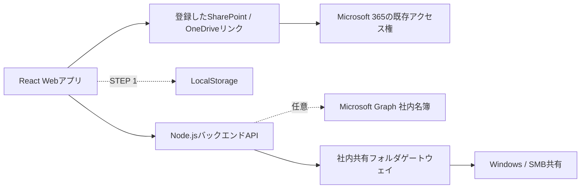

# 社内承認回覧

SharePoint、OneDrive、将来の社内共有フォルダに保存された業務ファイルを、案件ごとの専用URLで順番に承認回覧するWebアプリです。

デモ版：<https://waragamef-png.github.io/approval-circulation-app/>

> この公開版は画面・操作確認専用です。初期表示される氏名、メールアドレス、部門、案件、ファイルはすべてダミーデータです。実際の会社情報やSharePoint／OneDriveリンクは登録しないでください。

現在はSTEP 6まで実装済みです。SharePoint／OneDrive文書はコピーしたリンクを登録し、会社側で設定済みのアクセス権を使って開きます。文書参照用のTenant ID、Client ID、管理者同意は不要です。Microsoft Graphの社内名簿検索は任意機能で、未設定時はローカルの承認者マスタだけで動作します。

## システム概要

案件を開始すると、推測されにくいランダムな専用URLが1案件につき1つ発行されます。

1. 対象ファイルと回付ルートを設定
2. 案件専用URLを現在の確認者へメールで通知
3. 案件ページの先頭に「現在誰の承認待ちか」を表示
4. 確認OK・捺印済みなら次の確認者へ回付
5. NGなら開始者または処理済み承認者へ差し戻し
6. 次の宛先用メールをWebアプリ内で確認・編集して送信
7. 最後の承認者が完了すると開始者へ完了通知

承認操作に対する本人確認やMicrosoft 365ログインは行わず、案件URLを持つ利用者が処理できる方式を採用します。SharePoint／OneDrive文書を開いた際の閲覧可否は、Microsoft 365側の既存アクセス権で判定されます。

## アーキテクチャ



### 現在の構成

- ブラウザだけで動作するReact SPA
- 承認者、テンプレート、案件、履歴をLocalStorageへ保存
- SharePoint／OneDriveはコピーした文書リンクを登録し、実ファイルを別画面で開く
- 共有フォルダは確認用ファイルを使用
- メール作成・編集・送信画面はUIデモ
- 設定時のみ、バックエンドからMicrosoft Graphの社内ユーザーを検索

### 本接続後の構成

- 回覧データは会社PCのバックエンドへ保存する方向でSTEP 8に再設計
- SharePoint / OneDrive上の元データはリンクで参照し、会社側の既存アクセス権を利用
- 管理者設定を必要としない通知方法をSTEP 13で再検討
- SMB共有は社内APIまたはWindowsサービスを介して接続

## 使用技術

- React 19
- TypeScript 5
- Vite 8
- Node.js / Express
- MSAL Node
- pnpm
- LocalStorage（STEP 1のみ）
- Microsoft Graph API / バックエンドアプリ認証

## フォルダ構成

```text
approval-circulation-app/
├─ src/
│  ├─ App.tsx                    画面と回覧操作
│  ├─ main.tsx                   アプリ起動処理
│  ├─ mockData.ts                STEP 1用ダミーデータ
│  ├─ storage.ts                 LocalStorageデータ層
│  ├─ styles.css                 共通スタイル
│  ├─ types.ts                   ドメインモデル
│  ├─ services/
│  │  └─ directory.ts            社内ユーザー検索APIクライアント
│  └─ providers/
│     └─ StorageProvider.ts      ストレージ共通インターフェース
├─ server/
│  ├─ index.mjs                  Express API・ビルド済み画面の配信
│  ├─ graphAuth.mjs              MSALによるアプリ認証
│  └─ graphDirectory.mjs         Graphユーザー取得・検索・キャッシュ
├─ .env.example                  環境変数の記入例
├─ .gitignore
├─ index.html
├─ package.json
├─ pnpm-lock.yaml
├─ tsconfig.json
└─ vite.config.ts
```

## 起動方法

### Windowsで画面から起動

プロジェクトフォルダの `アプリを起動.cmd` をダブルクリックします。確認用サーバーが裏で起動し、`http://localhost:5173/` が自動で開きます。終了するときは `アプリを停止.cmd` をダブルクリックします。

この起動方法は、事前にビルド済みの画面を同じPCで確認するためのものです。ターミナル操作は不要です。

### 必要環境

- Node.js 22推奨
- pnpm 11推奨

### 初回起動

```bash
pnpm install
pnpm dev
```

ブラウザで `http://localhost:5173/` を開きます。

`pnpm dev`は画面（5173番）とAPI（3000番）を同時に起動します。Microsoft 365未設定でも画面確認は可能です。

### 会社PCでの起動

```bash
copy .env.example .env
pnpm install
pnpm build
pnpm start
```

同じPCでは `http://localhost:3000/` を開きます。社内LANの別PCから開く場合は、`.env`の`APP_HOST=0.0.0.0`、`APP_ALLOWED_ORIGINS`、Windowsファイアウォール、固定IPまたは社内DNSを管理者と設定してください。

`.env.example`の`VITE_API_BASE_URL=same-origin`は、アクセスに使った会社PCのアドレスへAPI通信する設定です。別PCから利用しても`localhost`へ誤接続しません。

### 確認用コマンド

```bash
pnpm typecheck
pnpm test
pnpm build
```

ホーム画面の「使い方」ポップアップ内にある「デモデータを初期化」を押すと、LocalStorageを初期状態へ戻せます。

## 案件URL

案件URLは以下の形式です。

```text
https://<社内Webアプリのホスト>/c/<ランダムアクセスキー>
```

連番の案件IDをURL認可情報として使用せず、案件ごとにランダムなアクセスキーを発行します。本人確認を行わない構成のため、URLを受け取った人は転送可能です。この挙動は要件上の仕様であり、必要になった場合は後から有効期限、URL再発行、アクセスログ、閲覧用PINなどを追加します。

## メール送信方針

STEP 1では、回覧開始・承認・差し戻し・再回覧の内容を案件へ反映する前に、Webアプリ内のメール作成画面を開きます。

- 宛先、件名、本文を自動作成
- 過去の承認者をCCへ自動入力し、同じメールアドレスと宛先アドレスの重複を除外
- 案件URL、現在の確認者、任意の差し戻しコメントを自動挿入
- 送信前にブラウザ上で編集可能
- 送信ボタンは現在デモ動作
- 「送信を確認」を押したときだけ案件と回付ルートを更新し、キャンセル時は何も変更しない

本接続後は、通知専用メールボックスからMicrosoft Graph `sendMail`を呼び出します。ブラウザへクライアントシークレットを置かず、バックエンドで証明書認証を使用する構成を第一候補とします。アプリケーション権限を使う場合は、Exchange Online Application RBACで送信元メールボックスを限定します。

## Microsoft Entra ID設定方法

利用者のログイン設定は不要です。承認者は案件URLを開いて処理します。

バックエンド用のシングルテナントアプリ登録を1つ作成します。STEP 4ではアプリケーション権限`User.Read.All`に管理者同意が必要です。Tenant ID、Client ID、証明書はバックエンドの環境変数で管理し、ブラウザへ渡しません。

1. Microsoft Entra管理センターでアプリを登録
2. Microsoft Graphのアプリケーション権限`User.Read.All`を追加
3. テナント管理者が同意
4. 証明書の公開鍵をアプリ登録へアップロード
5. 秘密鍵をリポジトリ外へ置き、`.env`へパスとSHA-256拇印を設定

クライアントシークレットにも対応していますが、確認用の一時利用に限定し、本運用は証明書を推奨します。

## Microsoft Graph設定方法

任意の社内名簿検索を有効にする場合だけ、以下のAPIを使用します。

- ユーザー検索：`/users`

ユーザー検索は`GET /users`から`id`、`displayName`、`mail`、`userPrincipalName`、`department`、`accountEnabled`だけを取得します。最大5,000名、5分間のバックエンドキャッシュを既定値とし、氏名・メール・部門を途中一致で検索します。Graph接続処理とアクセストークンはブラウザへ出しません。

## 必要Graph API権限

実装STEPごとに最小権限だけを追加します。

| 用途 | 候補権限 | 導入STEP |
|---|---|---:|
| ユーザー検索 | Application `User.Read.All`（必要な場合のみ） | 4 |

管理者へ依頼しない運用ではGraph社内名簿検索を設定せず、アプリ内の承認者マスタを使用します。SharePoint／OneDrive文書リンクの登録・閲覧にはGraph権限を使いません。

## SharePoint設定方法

STEP 5では、SharePointでコピーした文書リンクとファイル名を回覧へ登録します。

推奨手順：

1. SharePointで対象文書の「リンクをコピー」
2. 新しい回覧で「SharePointリンクを追加」を開く
3. コピーしたリンクを貼り付ける
4. 自動入力されたファイル名を確認し、必要な場合だけ修正
5. 案件画面の「文書を開く」から別画面でSharePointを開く

閲覧できる人は会社側で既に設定されたSharePointアクセス権に従います。アプリは権限を追加・変更せず、Tenant ID、Client ID、`Sites.Selected`、管理者同意も使用しません。

## OneDrive設定方法

STEP 6では、OneDriveもSharePointと同じリンク登録方式へ統合しました。

推奨手順：

1. OneDriveで対象文書の「リンクをコピー」
2. 新しい回覧の保存場所で「OneDrive」を選択
3. 「OneDriveリンクを追加」を開き、コピーしたリンクを貼り付ける
4. 自動入力されたファイル名を確認する。短縮リンクで自動入力されない場合だけファイル名を入力する
5. 案件画面の「文書を開く」から別画面でOneDriveを開く

会社のOneDriveで使われる`https://*-my.sharepoint.com/`形式と、`https://1drv.ms/`、`https://onedrive.live.com/`形式を登録できます。閲覧可否はOneDrive側の既存アクセス権に従い、アプリは権限を追加・変更しません。OneDrive用のDrive ID、Tenant ID、Client ID、管理者同意は不要です。

Webアプリの回覧ロジックは以下の共通契約だけを使用します。

```ts
interface StorageProvider {
  listFiles(): Promise<File[]>;
  getFile(fileId: string): Promise<File | undefined>;
  openFile(fileId: string): Promise<string>;
  downloadFile(fileId: string): Promise<Blob>;
  updateFile(fileId: string, content: Blob): Promise<void>;
  getMetadata(fileId: string): Promise<File | undefined>;
  getWebUrl(fileId: string): Promise<string>;
}
```

## 共有フォルダ対応方針

一般的なブラウザからSMB共有へ直接アクセスしません。STEP 12で以下のいずれかを社内環境に配置します。

- Windowsサービス
- 社内サーバー上のバックエンドAPI
- オンプレミス側エージェント

第一候補は、許可した共有フォルダだけを操作できる小さな社内APIです。パストラバーサル対策、許可ルート、監査ログ、サービスアカウント権限を設け、`SharedFolderProvider`から呼び出します。

## 会社PCへ保存する回覧データ

STEP 8ではSharePoint Listsを前提にせず、会社PCのバックエンドで共有保存できる方式を再設計します。保持するデータ項目は次のとおりです。

### Approvers

`id`、`name`、`email`、`department`、`entraUserId`、`active`、`createdAt`、`updatedAt`

### RouteTemplates

`id`、`name`、`description`、`createdBy`、`createdAt`、`updatedAt`

### RouteTemplateMembers

`routeTemplateId`、`approverId`、`sequence`、`requiresStamp`

### CirculationCases

`id`、`accessKeyHash`、`title`（任意の回覧名）、`providerType`、`fileId`、`fileName`、`fileUrl`、`initiatorId`、`initiatorName`、`startedAt`、`updatedAt`、`state`、`currentMemberId`

本接続時はランダムアクセスキーの平文ではなくハッシュ保存を検討します。

### CirculationMembers

`id`、`caseId`、`approverId`、`name`、`email`、`department`、`sequence`、`isInitiator`、`requiresStamp`、`status`、`completedAt`

### CirculationHistory

`id`、`caseId`、`actionUserId`、`actionUserName`、`action`、`comment`、`returnToUserId`、`previousState`、`newState`、`createdAt`

案件開始後の氏名、メール、部門、捺印要否は案件メンバーへスナップショット保存し、承認者マスタの変更で過去履歴が変化しないようにします。

## 実装済み機能

- 水色基調のPC向け業務UI
- ホームに案件一覧を常時表示し、上部のボタンから新しい回覧と承認者マスタを別ウィンドウで開く単一導線
- 別ウィンドウで変更したローカルデータの自動同期
- 承認者マスタの一覧・登録・編集・削除・無効化・検索
- 300ms debounce付き承認者オートコンプリート
- 氏名・メール・部門検索と、承認者マスタへの重複登録警告
- Microsoft Graphの社内ユーザー検索API
- SharePoint／OneDriveでコピーした文書リンクとファイル名の登録
- 文書リンクからのファイル名自動入力と、分からない場合の手入力
- 同じSharePoint／OneDriveリンクの重複登録防止
- 案件画面からSharePoint／OneDrive文書を別画面で開く
- 社内名簿ユーザーを回付ルートへ直接追加
- 社内名簿ユーザーを承認者マスタへ登録
- Entra IDに部門がないユーザーの表示・登録
- 回付ルート作成、ドラッグ、上下移動、削除、捺印要否変更
- 再確認のため、同じ承認者を1つの回付ルートへ複数回追加
- 任意の回覧名入力（未入力時は文書名を使用）
- 回覧開始者を先頭に含む回付ルートと、開始者以外の行のドラッグ並べ替え
- 保存済みの開始者名を固定表示し、「変更」を押したときだけ氏名・メール・部門から検索して再選択
- ルートテンプレートの保存・読込・上書き・複製・削除
- 複数のSharePoint／OneDrive文書リンク登録と、文書ごとの「捺印対象 / 確認のみ」設定
- 文書・回付ルートの設定後に回覧を開始する縦型の操作導線
- 案件開始とランダムな案件専用URL発行
- 案件一覧、案件詳細、現在の確認者、進捗、履歴
- 回付ルート内の処理履歴・差し戻し内容表示
- 現在の承認待ち者を強調し、その人の回付ルート行へ対象文書と処理操作を集約
- 差し戻し前の結果を残し、戻り先から「差し戻し後の回付ルート」を新しい連番で再表示
- 回付者ごとの「捺印あり／確認のみ」文字ラベル表示
- 確認完了、捺印・確認完了、差し戻し
- 未処理ルートの途中追加・削除・並べ替え・捺印要否変更
- Webアプリ内のメール作成・編集・送信デモ
- 回覧開始直後の、最初の回付者向け承認依頼メール下書き
- LocalStorage保存とデモデータ初期化

## 未実装機能

- 会社環境でのOneDrive実ファイル起動確認
- 共有フォルダの実ファイル起動
- 会社PCバックエンドへの回覧データ保存
- 複数PC間での案件共有
- Microsoft Graphによる実メール送信
- 共有フォルダゲートウェイ
- 本番用バックエンド、監査、運用監視

## セキュリティ

- Microsoft 365パスワードを保存しない
- クライアントシークレットをソースコードやブラウザへ置かない
- ローカル設定は`.env`を使用し、Gitへコミットしない
- `.env.example`には値を記載しない
- 証明書や秘密鍵をGitへコミットしない
- 印影・署名画像をアプリへ保存しない
- Graph権限はSTEPごとに最小権限で追加
- STEP 4のGraph社内名簿検索は任意で、管理者へ依頼しない運用では使用しない
- SharePoint文書は`https`かつ`sharepoint.com`のリンクだけを登録可能
- OneDrive文書は`https`かつ`sharepoint.com`、`1drv.ms`、`onedrive.live.com`のリンクだけを登録可能
- SharePoint／OneDriveアクセス権は会社側の既存設定に任せ、アプリから追加・変更しない
- Graphアクセストークンはバックエンド内だけで使用
- 社内名簿APIは許可した接続元だけにCORS応答
- メール送信権限は専用メールボックスへ限定
- ランダム案件URLは転送可能なため、URL漏えいリスクを運用上明示

## 制約事項

- STEP 1のデータは現在のブラウザだけに保存されます
- 選択した開始者も同じブラウザでは保持されますが、別PC・別ブラウザ・プライベートブラウズ・ブラウザデータ消去後は再選択が必要です
- `localhost`の案件URLは別PCから開けません
- 「メール送信」はUIデモで、実際のメールは送られません
- SharePoint／OneDrive文書は一覧から自動取得せず、利用者がコピーしたリンクを登録します
- リンクを開いた後の閲覧可否は、会社側の既存アクセス権に従います
- Microsoft 365へ未ログインの場合、リンク先で会社アカウントのログインを求められる場合があります
- PDFへの捺印有無を自動判定しません
- 同時更新、排他制御、ネットワーク障害対策は未実装です
- 本人認証を行わないため、社内名簿APIを公開インターネットへ直接公開しないでください
- 5,000名を超えるテナントは`GRAPH_DIRECTORY_MAX_USERS`と検索方式の再検討が必要です
- Graphユーザー情報は既定で最大5分遅れて反映されます
- 管理者設定をしない運用ではMicrosoft Graph社内名簿検索を使用しません
- スマートフォンよりPCブラウザを優先しています

## 開発STEP

- [x] STEP 0：設計
- [x] STEP 1：完全ローカルUIモック
- [x] STEP 2：Git管理用ファイル整備
- [x] STEP 3：利用者ログイン不要の方式へ変更（バックエンド接続は後続STEP）
- [x] STEP 4：Microsoft Graphユーザー検索（任意機能、通常運用はローカル承認者マスタ）
- [x] STEP 5：SharePointリンク登録と実ファイル起動
- [x] STEP 6：OneDriveリンク登録
- [ ] STEP 7：会社環境でのOneDrive実ファイル確認／共有フォルダ起動
- [ ] STEP 8：会社PCバックエンドへ回覧情報を保存
- [ ] STEP 9：実回覧
- [ ] STEP 10：NG・差し戻し
- [ ] STEP 11：途中ルート編集
- [ ] STEP 12：共有フォルダ対応
- [ ] STEP 13：実メール通知（管理者設定不要の方式を再検討）

## リポジトリと公開版

- リポジトリ：<https://github.com/waragamef-png/approval-circulation-app>
- 画面確認用GitHub Pages：<https://waragamef-png.github.io/approval-circulation-app/>
- `main`へpushするとGitHub Actionsが型検査とビルドを行い、GitHub Pagesへ反映します。

GitHub Pagesはダミーデータだけを使う画面確認用です。会社の実データやMicrosoft 365接続情報は登録しません。
